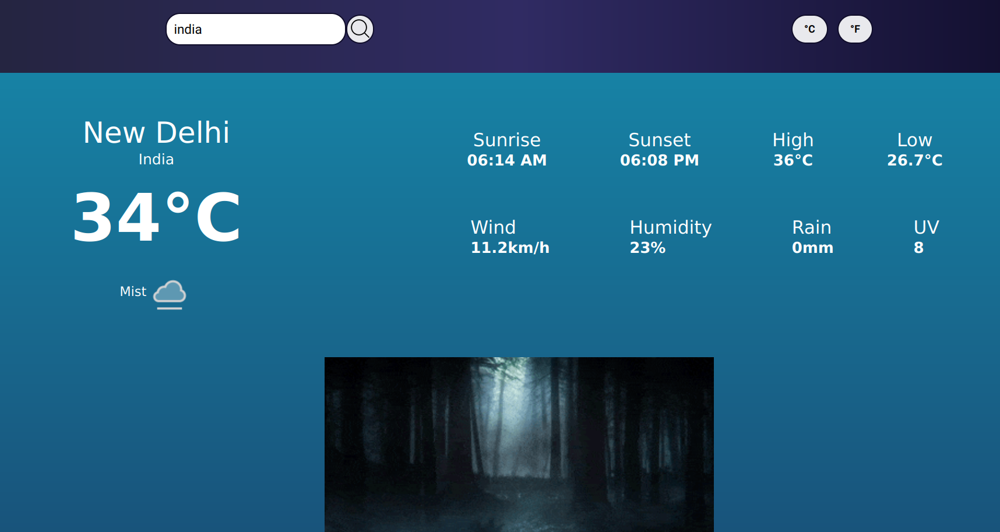

# WeatherApp

<div id="top"></div>

<!-- PROJECT LOGO -->

<h3 align="center">Weather app</h3>

  <p align="center">
    Weather application used to show forecast from Weatherapi API.
    <br />
    <a href="https://technmad.github.io/WeatherApp/"><strong>View Demo</strong></a>
    ·
    <a href="https://technmad.github.io/WeatherApp/issues" target="_blank"><b>Report Bug</b></a>
    ·
    <a href="https://technmad.github.io/WeatherApp/issues" target="_blank"><b>Request Feature</b> </a>
<!-- ABOUT THE PROJECT -->

## About The Project



Learning project from [The Odin Project](https://www.theodinproject.com/lessons/node-path-javascript-weather-app) curriculum.

### Features

- Get current forecast.
- Search cities worldwide.
- Switch between imperial and metric systems.
- Responsive design.

### Built With

#### Technologies

- JavaScript
- CSS
- HTML

#### Tools

- Visual Studio Code
- Linux terminal
- Git and GitHub
- Webpack
- ESLint + Airbnb JavaScript Style Guide
- Prettier

<p align="right">(<a href="#top">back to top</a>)</p>

<!-- GETTING STARTED -->

## Getting Started

These instructions will get you a copy of the project up and running on your local machine for development and testing purposes.

### Prerequisites

You will need `Node.js` and `npm` installed globally on your machine.

- [Downloading and installing Node.js and npm](https://docs.npmjs.com/downloading-and-installing-node-js-and-npm)

### Installation

1. Get a free API key at [https://www.weatherapi.com/](https://www.weatherapi.com/)
2. Clone the repo
   ```sh
   git clone https://github.com/Technmad/WeatherApp.git
   ```
3. Install NPM packages
   ```sh
   npm install
   ```
4. Enter your API key in `./src/api.js`
   ```js
   const API_KEY = "YOUR API KEY";
   ```
5. Build an app
   ```sh
   npm run build
   ```

<p align="right">(<a href="#top">back to top</a>)</p>

## Usage

- Open `./dist/index.html` file with browser.

<p align="right">(<a href="#top">back to top</a>)</p>

<!-- OUTCOME -->

## Outcome

- Used revealing module pattern for better code organizing.
- Used public API to get data.
- Used Webpack to build the app.
- Used third-party library for date and time formating.
- Used CSS3 grid and flex to create layout.
- Used HTML5 semantic elements for better readability and structure.
- Used Git and GitHub for project management.
- Learned error handling a bit.
- Tried to maintain clean code.
- Cross tested on Firefox and Chromium based browsers.

<p align="right">(<a href="#top">back to top</a>)</p>

<!-- AUTHORS -->

## Authors
<div align=center>
<a href="https://linkedin.com/in/technmad" target="_blank">
	
</a>&nbsp;&nbsp;&nbsp;
<a href="mailto:anuragpathakoffl@gmail.com" target="_blank">
	
</a> &nbsp;&nbsp;&nbsp;
</div>
<p align="right">(<a href="#top">back to top</a>)</p>

<!-- ACKNOWLEDGMENTS -->

## Acknowledgments

- [The Odin Project](https://www.theodinproject.com/)
- [MDN Docs](https://developer.mozilla.org/en-US/)
- [Hitesh Choudhary](https://github.com/hiteshchoudhary/)

<p align="right">(<a href="#top">back to top</a>)</p>
